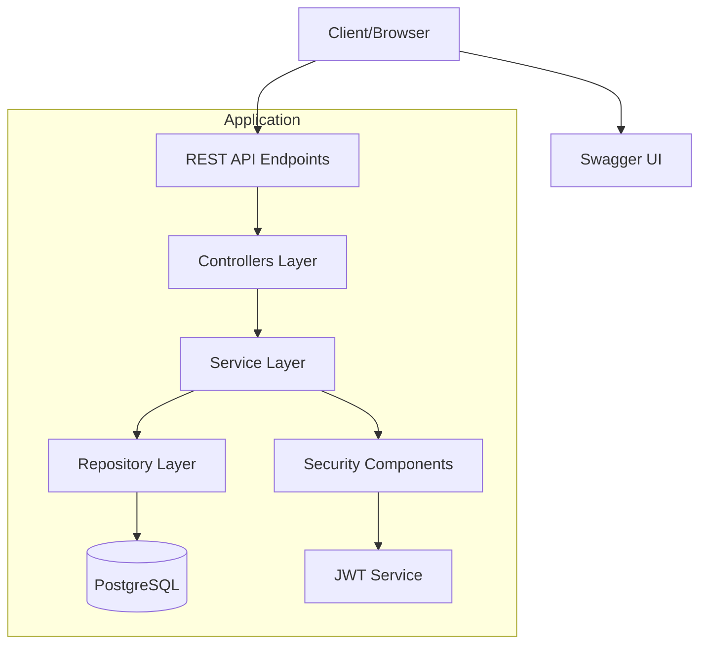
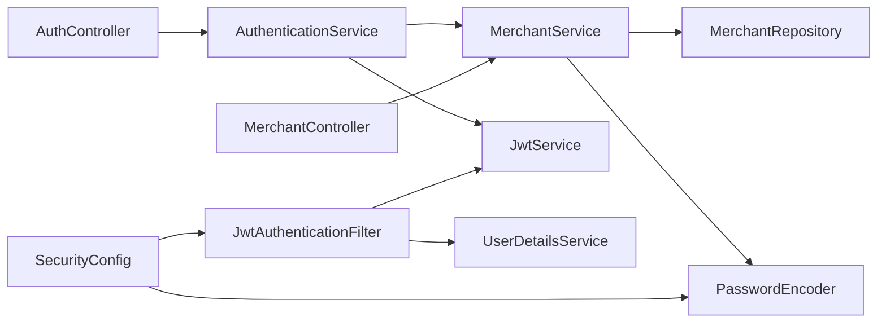

# Merchant Management System - Technical Documentation

## System Architecture

## Component Overview

### 1. Controllers Layer
Location: `src/main/java/com/merchant/api/controller/`
- **AuthController**: Handles authentication endpoints
  - `POST /api/v1/auth/register`
  - `POST /api/v1/auth/login`
- **MerchantController**: Manages merchant CRUD operations
  - `GET /api/v1/merchants`
  - `GET /api/v1/merchants/{id}`
  - `POST /api/v1/merchants`
  - `PUT /api/v1/merchants/{id}`
  - `DELETE /api/v1/merchants/{id}`

### 2. Service Layer
Location: `src/main/java/com/merchant/api/service/`
- **AuthenticationService**: Manages authentication logic
  - `register(Merchant)`: Creates new merchant and generates JWT
  - `login(email, password)`: Authenticates merchant and generates JWT
- **MerchantService**: Handles merchant business logic
  - `getAllMerchants()`: Retrieves all merchants
  - `getMerchantById(id)`: Finds merchant by ID
  - `createMerchant(Merchant)`: Creates new merchant
  - `updateMerchant(id, Merchant)`: Updates existing merchant
  - `deleteMerchant(id)`: Removes merchant
- **JwtService**: Manages JWT operations
  - `generateToken(UserDetails)`: Creates new JWT
  - `validateToken(token)`: Validates JWT
  - `extractUsername(token)`: Extracts user info from JWT

### 3. Repository Layer
Location: `src/main/java/com/merchant/api/repository/`
- **MerchantRepository**: Handles database operations
  - Extends `JpaRepository<Merchant, Long>`
  - Custom methods:
    - `findByEmail(String email)`
    - `existsByEmail(String email)`

### 4. Security Components
Location: `src/main/java/com/merchant/api/security/`
- **JwtAuthenticationFilter**: Intercepts and processes JWT tokens
- **SecurityConfig**: Configures security settings
  - JWT authentication
  - Password encoding
  - Endpoint authorization
  - CORS and CSRF settings

### 5. Models and DTOs
Location: `src/main/java/com/merchant/api/model/` & `src/main/java/com/merchant/api/dto/`
- **Merchant**: Main entity class
- **MerchantRegistrationRequest**: DTO for registration

## Dependency Flow

## Component Dependencies

### Controllers
- **AuthController**
  - Depends on: `AuthenticationService`
  - Uses: `MerchantRegistrationRequest`, `Merchant`

- **MerchantController**
  - Depends on: `MerchantService`
  - Uses: `Merchant`

### Services
- **AuthenticationService**
  - Depends on: `MerchantService`, `JwtService`, `AuthenticationManager`
  - Uses: `Merchant`, `UserDetails`

- **MerchantService**
  - Depends on: `MerchantRepository`, `PasswordEncoder`
  - Uses: `Merchant`

- **JwtService**
  - Uses: `UserDetails`, JWT libraries

### Security
- **JwtAuthenticationFilter**
  - Depends on: `JwtService`, `UserDetailsService`
  - Uses: `SecurityContextHolder`

- **SecurityConfig**
  - Depends on: `MerchantRepository`, `JwtService`
  - Configures: `SecurityFilterChain`, `AuthenticationProvider`

## Technologies Used

1. **Spring Boot 3.1.5**
   - Spring Web
   - Spring Security
   - Spring Data JPA
   - Spring Validation

2. **Database**
   - PostgreSQL
   - JPA/Hibernate

3. **Security**
   - JWT (JSON Web Tokens)
   - BCrypt password encoding

4. **Documentation**
   - Swagger/OpenAPI 3.0

5. **Build Tool**
   - Maven

## Data Flow Example

### Registration Process
1. Client sends registration request to `/api/v1/auth/register`
2. `AuthController` validates request using `@Valid`
3. Creates `Merchant` object from `MerchantRegistrationRequest`
4. `AuthenticationService.register()` is called
5. `MerchantService` encrypts password and saves to database
6. `JwtService` generates token
7. Returns token to client

### Authentication Process
1. Client sends login request to `/api/v1/auth/login`
2. `AuthController` processes login request
3. `AuthenticationService` validates credentials
4. `JwtService` generates token
5. Returns token to client

### Protected Endpoint Access
1. Client sends request with JWT in header
2. `JwtAuthenticationFilter` intercepts request
3. `JwtService` validates token
4. Request proceeds to appropriate controller
5. Controller calls service layer
6. Service layer interacts with repository
7. Response returns to client

## Security Implementation

1. **JWT Security**
   - Token generation on login/register
   - Token validation on each request
   - Stateless session management

2. **Password Security**
   - BCrypt encoding
   - No plain text storage

3. **Endpoint Security**
   - Role-based access control
   - Protected endpoints
   - CSRF protection

## Error Handling

1. **Global Exception Handling**
   - Validation errors (400)
   - Authentication errors (401)
   - Authorization errors (403)
   - Not found errors (404)
   - Conflict errors (409)

2. **Custom Error Responses**
   - Structured error messages
   - Appropriate HTTP status codes
   - Detailed error information

## Testing Instructions

1. Start the application
2. Access Swagger UI at http://localhost:8080/swagger-ui.html
3. Register a new merchant
4. Login to get JWT token
5. Use token for protected endpoints
6. Test CRUD operations

## Future Enhancements

1. Role-based authorization
2. Email verification
3. Password reset functionality
4. Rate limiting
5. Audit logging
6. Caching implementation

## Detailed Component Relationships

### Controllers and Their Dependencies

1. **AuthController** (`src/main/java/com/merchant/api/controller/AuthController.java`)
   - Services Used:
     - `AuthenticationService`
   - Models/DTOs Used:
     - `MerchantRegistrationRequest` (for registration)
     - `Merchant` (for creating merchant object)
     - `LoginRequest` (record for login credentials)
   - Endpoints:
     - POST `/api/v1/auth/register` (returns 201 CREATED)
     - POST `/api/v1/auth/login` (returns 200 OK)

2. **MerchantController** (`src/main/java/com/merchant/api/controller/MerchantController.java`)
   - Services Used:
     - `MerchantService`
   - Models Used:
     - `Merchant` (for CRUD operations)
   - Endpoints:
     - GET `/api/v1/merchants` (returns 200 OK)
     - GET `/api/v1/merchants/{id}` (returns 200 OK)
     - POST `/api/v1/merchants` (returns 201 CREATED)
     - PUT `/api/v1/merchants/{id}` (returns 200 OK)
     - DELETE `/api/v1/merchants/{id}` (returns 204 NO CONTENT)

### Services and Their Dependencies

1. **AuthenticationService** (`src/main/java/com/merchant/api/service/AuthenticationService.java`)
   - Dependencies:
     - `MerchantService`
     - `JwtService`
     - `AuthenticationManager`
   - Models Used:
     - `Merchant`
     - `UserDetails` (Spring Security)
   - Methods:
     - `register(Merchant)`
     - `login(String email, String password)`

2. **MerchantService** (`src/main/java/com/merchant/api/service/MerchantService.java`)
   - Dependencies:
     - `MerchantRepository`
     - `PasswordEncoder`
   - Models Used:
     - `Merchant`
   - Methods:
     - `getAllMerchants()`
     - `getMerchantById(Long id)`
     - `createMerchant(Merchant)`
     - `updateMerchant(Long id, Merchant)`
     - `deleteMerchant(Long id)`
     - `findByEmail(String email)`

3. **JwtService** (`src/main/java/com/merchant/api/security/JwtService.java`)
   - Dependencies:
     - JWT libraries (io.jsonwebtoken)
   - Models Used:
     - `UserDetails` (Spring Security)
   - Methods:
     - `generateToken(UserDetails)`
     - `validateToken(String token)`
     - `extractUsername(String token)`

### Repositories and Their Dependencies

1. **MerchantRepository** (`src/main/java/com/merchant/api/repository/MerchantRepository.java`)
   - Extends:
     - `JpaRepository<Merchant, Long>`
   - Models Used:
     - `Merchant`
   - Custom Methods:
     - `findByEmail(String email)`
     - `existsByEmail(String email)`
   - Used By:
     - `MerchantService`
     - `SecurityConfig` (for user details service)

### Models and Their Usage

1. **Merchant** (`src/main/java/com/merchant/api/model/Merchant.java`)
   - Used In:
     - Controllers:
       - `AuthController`
       - `MerchantController`
     - Services:
       - `AuthenticationService`
       - `MerchantService`
     - Repository:
       - `MerchantRepository`
   - Annotations:
     - `@Entity`
     - `@Table(name = "merchants")`
   - Key Fields:
     - `id` (auto-generated)
     - `businessName`
     - `email`
     - `password`
     - `phoneNumber`
     - Other business fields

2. **MerchantRegistrationRequest** (`src/main/java/com/merchant/api/dto/MerchantRegistrationRequest.java`)
   - Used In:
     - `AuthController` (for registration endpoint)
   - Fields:
     - `businessName`
     - `email`
     - `password`
     - `phoneNumber`
     - Other business fields

### Security Components and Their Dependencies

1. **JwtAuthenticationFilter** (`src/main/java/com/merchant/api/security/JwtAuthenticationFilter.java`)
   - Dependencies:
     - `JwtService`
     - `UserDetailsService`
   - Used In:
     - `SecurityConfig`

2. **SecurityConfig** (`src/main/java/com/merchant/api/security/SecurityConfig.java`)
   - Dependencies:
     - `MerchantRepository`
     - `JwtService`
     - `PasswordEncoder`
     - `JwtAuthenticationFilter`
   - Configures:
     - Security filter chain
     - Authentication provider
     - Password encoding
     - Protected endpoints

### Database Schema Relationships

1. **merchants** table
   - Primary Key: `id` (auto-increment)
   - Unique Constraints:
     - `email`
   - Columns:
     - All fields from Merchant entity
   - Timestamps:
     - `created_at`
     - `updated_at` 